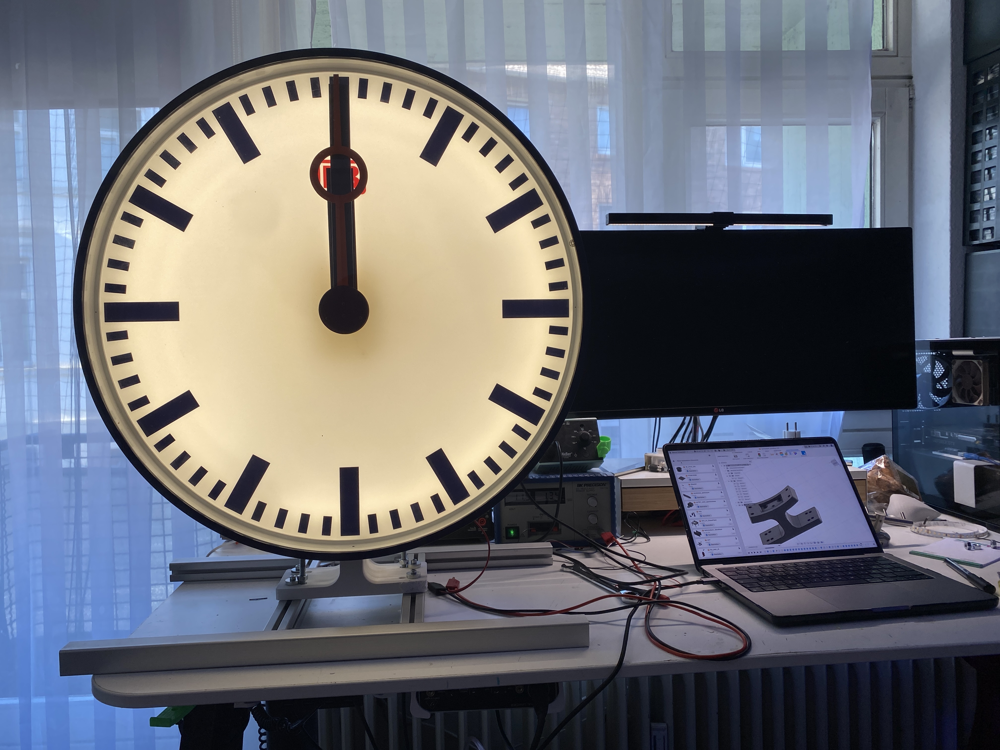

# DBClock

## Features

* 

## Bahnhofsuhr-DB

[bahnhofsuhr-db-shop](https://bahnshop.de/db-originale/sonstiges/1749/bahnhofsuhr-db)

Dark blue metal case, acrylic glass panes, dial white,with black hour and minute markers, red hole second hand, red DB logo unlit.

Condition: used, in new design, the sale is in the current condition as a decorative object, a function can not be guaranteed, rust spots, paint chips and scratches in the glass and paint are part of the character. The holder is not included in the delivery. The article picture is an exemplary representation.

Dimensions: 60 cm diameter
Weight: approx. 30 kg

Shipping is by freight forwarding on one-way pallet (free curbside). Disposal of the pallet is done by the customer.

In my clock, `BU 190t S230` the clock-drives were used.

## BU 190t S230

A complete manual for the drive can be found on the manufacturers website:
[Uhrwerk-BU-190-230-Installation.pdf](https://www.buerk-mobatime.de/wp-content/uploads/2020/01/BD-800603.01-Uhrwerk-BU-190-230-Installation.pdf)

